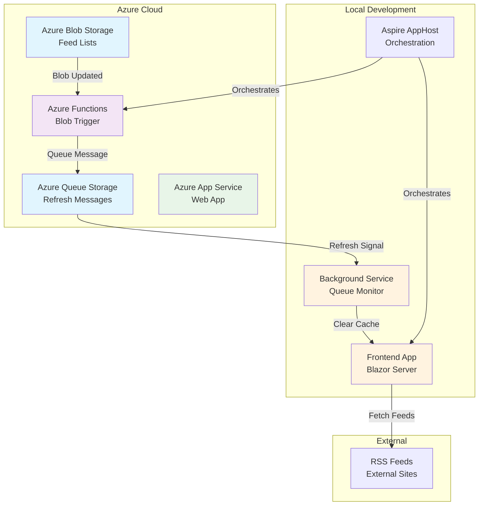

# ReadR - RSS Aggregation App for Visual Studio and Azure Demos

ReadR is a comprehensive RSS aggregation application designed to demonstrate the evolution of a .NET application using Visual Studio and Azure technologies. This repository contains the complete end-state application along with phase branches that show the progressive development journey.

## Application Overview

ReadR is a Blazor Server application that aggregates RSS feeds with categorization and caching capabilities. The final application architecture includes:

- **Frontend**: Blazor Server app with memory caching and real-time feed updates
- **Backend**: Azure Functions for feed processing and queue management
- **Storage**: Azure Blob Storage for feed configurations and Azure Queue Storage for messaging
- **Orchestration**: .NET Aspire for local development and cloud deployment
- **Deployment**: Azure App Service and Azure Container Apps support

### Application Architecture (End State)



### Key Features

- **RSS Feed Aggregation**: Automatically fetches and displays RSS feeds from multiple sources
- **Categorized Display**: Organizes feeds by categories for better user experience
- **Memory Caching**: Prevents excessive API calls and improves performance
- **Event-Driven Updates**: Uses Azure Functions and queues for real-time feed refresh
- **Cloud-Native Architecture**: Designed for Azure with managed identity authentication
- **Local Development Support**: .NET Aspire orchestration for seamless development experience

## Development Phases

This repository demonstrates the progressive evolution of a .NET application through five distinct phases:

### Phase 1 - Basic Web Application
**Branch**: [`phase1-webapp-only`](https://github.com/bradygaster/ReadR/tree/phase1-webapp-only)

A simple Blazor Server application with:
- Basic RSS feed display
- Memory caching for performance
- Hardcoded feed configurations
- Azure App Service deployment capability

### Phase 2 - Azure Storage Integration
**Branch**: [`phase2-storage`](https://github.com/bradygaster/ReadR/tree/phase2-storage)

Adds cloud storage capabilities:
- Azure Blob Storage for feed list configuration
- Managed identity authentication (no connection strings)
- Visual Studio Connected Services integration
- Shared library for common functionality

### Phase 3 - Event-Driven Architecture
**Branch**: [`phase3-function-blob-trigger`](https://github.com/bradygaster/ReadR/tree/phase3-function-blob-trigger)

Introduces serverless processing:
- Azure Functions with blob triggers
- Queue messaging for decoupled communication
- Background services for cache invalidation
- Automatic feed refresh when configuration changes

### Phase 4 - Local Development Orchestration
**Branch**: [`phase4-adding-aspire`](https://github.com/bradygaster/ReadR/tree/phase4-adding-aspire)

Improves development experience:
- .NET Aspire orchestration for multi-service applications
- Integrated dashboard for monitoring and debugging
- Service discovery and dependency management
- Simplified local development workflow

### Phase 5 - Cloud Deployment
**Branch**: [`phase5-deploying-with-aspire`](https://github.com/bradygaster/ReadR/tree/phase5-deploying-with-aspire)

Production deployment capabilities:
- Azure Developer CLI (`azd`) support
- Infrastructure as Code with Bicep templates
- Azure Container Apps deployment
- Production monitoring and logging

## Getting Started

### Prerequisites

- Visual Studio 2022 (latest version)
- .NET 9 SDK
- Azure subscription (for cloud features)
- Docker Desktop (for Aspire development)

### Running Locally

1. **Clone the repository**:
   ```bash
   git clone https://github.com/bradygaster/ReadR.git
   cd ReadR
   ```

2. **Open in Visual Studio**:
   - Open `ReadR.slnx` in Visual Studio 2022
   - Ensure the Aspire workload is installed

3. **Run with Aspire**:
   - Set `ReadR.AppHost` as the startup project
   - Press F5 to start all services
   - The Aspire dashboard will open automatically

### Deployment to Azure

The application supports deployment via Azure Developer CLI:

```bash
azd init
azd auth login
azd up
```

This will provision all necessary Azure resources and deploy the application.

## For Presenters

If you're planning to present or demo this application, see the [Demo Cheat Sheet](demo-cheat-sheet.md) for detailed step-by-step instructions for each phase of the demonstration.

Setup scripts are provided to quickly prepare demo environments:

**Linux/macOS:**
```bash
chmod +x setup-demo.sh
./setup-demo.sh
```

**Windows:**
```powershell
./setup-demo.ps1
```

## Project Structure

```
ReadR/
├── ReadR.AppHost/              # Aspire orchestration project
├── ReadR.Frontend/             # Blazor Server web application
├── ReadR.Serverless/           # Azure Functions project
├── ReadR.ServiceDefaults/      # Shared Aspire service configurations
├── ReadR.Shared/               # Common models and services
├── infra/                      # Bicep infrastructure templates
├── demo-cheat-sheet.md         # Detailed presenter instructions
├── setup-demo.sh               # Demo setup script (Linux/macOS)
├── setup-demo.ps1              # Demo setup script (Windows)
└── azure.yaml                  # Azure Developer CLI configuration
```

## Technologies Demonstrated

- **Frontend**: Blazor Server, ASP.NET Core
- **Backend**: Azure Functions, Background Services
- **Storage**: Azure Blob Storage, Azure Queue Storage
- **Authentication**: Managed Identity, DefaultAzureCredential
- **Orchestration**: .NET Aspire
- **Deployment**: Azure Developer CLI, Azure Container Apps
- **Infrastructure**: Bicep templates, Infrastructure as Code
- **Development**: Visual Studio 2022, Connected Services

## Additional Resources

- [.NET Aspire Documentation](https://learn.microsoft.com/en-us/dotnet/aspire/)
- [Azure Functions Documentation](https://learn.microsoft.com/en-us/azure/azure-functions/)
- [Azure Developer CLI Documentation](https://learn.microsoft.com/en-us/azure/developer/azure-developer-cli/)
- [Visual Studio Azure Tools](https://docs.microsoft.com/en-us/azure/developer/visual-studio/overview)

## Contributing

This repository is primarily designed for demonstration purposes. If you have suggestions for improvements or find issues, please open an issue or submit a pull request.