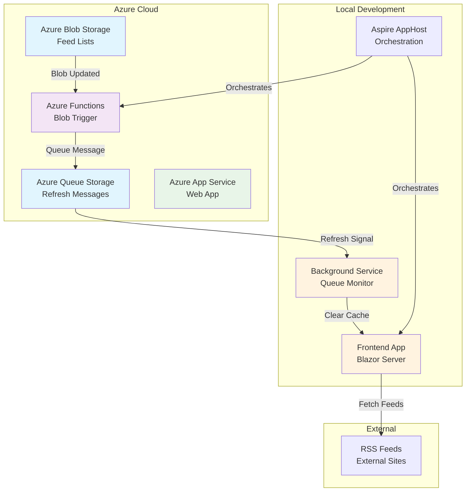
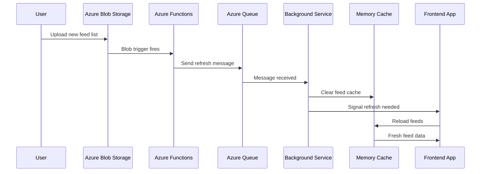

# ReadR - RSS Aggregation App for Visual Studio and Azure Demos

ReadR is a comprehensive RSS aggregation application designed to demonstrate the evolution of a .NET application using Visual Studio and Azure technologies. This repository contains the complete end-state application along with phase branches that show the progressive development journey.

## Application Overview

ReadR is a Blazor Server application that aggregates RSS feeds with categorization and caching capabilities. The final application architecture includes:

- **Frontend**: Blazor Server app with memory caching and real-time feed updates
- **Backend**: Azure Functions for feed processing and queue management
- **Storage**: Azure Blob Storage for feed configurations and Azure Queue Storage for messaging
- **Orchestration**: .NET Aspire for local development and cloud deployment
- **Deployment**: Azure App Service and Azure Container Apps support

### Application Architecture (End State)



### Key Features

- **Categorized RSS Feeds**: Organize feeds by topics for easy browsing
- **Memory Caching**: Efficient caching to minimize external HTTP requests
- **Real-time Updates**: Automatic cache refresh when feed lists change
- **Responsive Design**: Clean, modern UI for feed browsing
- **Cloud-Native**: Built for Azure with local development support

## Presentation Phases

This repository contains five distinct phases, each demonstrating different Visual Studio and Azure capabilities. Each phase builds upon the previous one, showing the natural evolution of a modern .NET application.

### Phase 1 - The ReadR Web App's Starting Point
**Branch**: [`phase1-webapp-only`](https://github.com/bradygaster/ReadR/tree/phase1-webapp-only)

**What it demonstrates**: Basic Blazor Server application with memory caching and RSS parsing capabilities.

#### Application Summary
The Phase 1 application is a standalone Blazor Server app that:
- Reads RSS feeds from a hardcoded list in the application
- Uses memory caching to store feed entries and avoid excessive HTTP requests
- Displays feeds in a categorized, responsive interface
- Includes a favicon service and fallback icons for better visual presentation

#### Demo Steps for Presenters
1. **Show the application running locally**:
   - Open the solution in Visual Studio
   - Press F5 to run the application
   - Demonstrate the feed categories and responsive layout
   - Point out the memory caching behavior by refreshing pages

2. **Highlight the code structure**:
   - Show the `FileFeedSource.cs` with hardcoded feed lists
   - Explain the memory caching implementation in `FeedCacheService.cs`
   - Demonstrate the RSS parsing logic in `FeedParser.cs`

3. **Deploy to Azure App Service**:
   - Right-click the project in Solution Explorer
   - Select "Publish..."
   - Choose "Azure App Service (Linux)" or "Azure App Service (Windows)"
   - Walk through the publish wizard to create a new App Service
   - **Generate GitHub Actions Workflow**: When prompted, choose to generate a GitHub Actions workflow
   - Explain that the generated workflow uses OIDC authentication (similar to `azd pipeline config`)
   - Note: Upcoming Visual Studio updates will also support Azure DevOps Pipelines detection and generation

4. **Key Teaching Points**:
   - Memory caching prevents excessive HTTP requests to RSS feeds
   - GitHub Actions workflow generation with OIDC authentication
   - Azure App Service hosting for .NET applications
   - Future Azure DevOps Pipelines support in Visual Studio

### Phase 2 - Adding Azure Storage
**Branch**: [`phase2-storage`](https://github.com/bradygaster/ReadR/tree/phase2-storage)

**What it demonstrates**: Azure Storage integration using Visual Studio Connected Services with managed identity authentication.

#### Changes from Phase 1
- Feed list configuration moved from hardcoded files to Azure Blob Storage
- Added Azure Storage SDK integration
- Implemented managed identity authentication (no connection strings!)
- Extracted RSS parsing into a separate class library (`ReadR.Shared`)

#### Demo Steps for Presenters
1. **Add Azure Storage via Connected Services**:
   - Right-click the project in Solution Explorer
   - Select "Add" → "Connected Service"
   - Choose "Azure Storage"
   - Select or create a Storage Account in your Azure subscription
   - **Key Point**: The wizard configures both your application code AND secures the Azure resource
   - Notice no connection strings or secrets are stored in your project

2. **Show the code changes**:
   - Examine `AzureBlobFeedSource.cs` replacing `FileFeedSource.cs`
   - Point out the use of `DefaultAzureCredential` for authentication
   - Show how feed lists are now read from blob storage

3. **Create the shared library**:
   - Right-click solution → "Add" → "New Project" → "Class Library"
   - Move RSS parsing logic to `ReadR.Shared`
   - Add project reference from main app to shared library

4. **Test with Azure Storage**:
   - Upload a JSON feed list to the blob container
   - Show how the application reads from Azure instead of local files
   - Demonstrate the security model (no secrets in code or config)

5. **Key Teaching Points**:
   - Connected Services eliminates connection string management
   - Managed identity provides secure, credential-free authentication
   - Separation of concerns with shared libraries
   - Azure Storage integration for configuration data

### Phase 3 - Triggering Updates When Feed List Changes
**Branch**: [`phase3-function-blob-trigger`](https://github.com/bradygaster/ReadR/tree/phase3-function-blob-trigger)

**What it demonstrates**: Azure Functions integration with blob triggers and queue messaging for real-time updates.

#### Changes from Phase 2
- Added Azure Functions project with .NET 9 Isolated runtime
- Implemented blob trigger to monitor feed list changes
- Added Azure Queue Storage for messaging between components
- Added background service in frontend to monitor queues and refresh cache

#### Architecture with Functions


#### Demo Steps for Presenters
1. **Add Azure Functions project**:
   - Right-click solution → "Add" → "New Project"
   - Choose "Azure Functions" (.NET 9 Isolated)
   - Add the blob trigger function code

2. **Configure the blob trigger**:
   - Show `FeedListUpdateTrigger.cs` with blob trigger attribute
   - Explain the connection to blob storage container
   - Demonstrate the queue output binding

3. **Add queue monitoring to frontend**:
   - Show `QueueBackgroundService.cs` implementation
   - Explain how it monitors Azure Queue Storage
   - Demonstrate cache clearing when messages arrive

4. **Deploy Functions to Azure**:
   - Right-click Functions project → "Publish..."
   - Choose deployment target (Functions on Windows/Linux, App Service Plan, or Flex)
   - Generate GitHub Actions workflow for automated deployment
   - Show integration with the main web app

5. **Test the complete flow**:
   - Upload a modified feed list to blob storage
   - Watch function execution in Azure portal
   - See queue message creation
   - Observe frontend cache refresh
   - Show updated feeds without redeployment

6. **Key Teaching Points**:
   - Event-driven architecture with Azure Functions
   - Blob triggers for file monitoring
   - Queue-based messaging for loose coupling
   - Background services in ASP.NET Core
   - No application redeployment needed for feed updates

### Phase 4 - Adding Aspire
**Branch**: [`phase4-adding-aspire`](https://github.com/bradygaster/ReadR/tree/phase4-adding-aspire)

**What it demonstrates**: .NET Aspire orchestration for improved local development experience and cloud-ready architecture.

#### Changes from Phase 3
- Added Aspire AppHost project for orchestration
- Added ServiceDefaults for common configurations
- Integrated frontend and functions projects with Aspire
- Added Azure resource bindings and role assignments
- Enhanced development dashboard experience

#### Demo Steps for Presenters
1. **Add Aspire to the solution**:
   - Right-click solution → "Add" → "New Project"
   - Choose ".NET Aspire App Host"
   - Add Aspire references to existing projects

2. **Configure Aspire orchestration**:
   - Show `AppHost.cs` with Azure Storage and project configurations
   - Explain resource bindings and role assignments
   - Demonstrate wait dependencies between services

3. **Set up Connected Services for Aspire**:
   - Click on Connected Services node in AppHost project
   - Configure Azure subscription and resource group
   - Show how Aspire manages Azure resource connections

4. **Clear user secrets for clean demo**:
   - Run commands to clear secrets from all projects:
     ```bash
     dotnet user-secrets clear --project ReadR.AppHost
     dotnet user-secrets clear --project ReadR.Frontend  
     dotnet user-secrets clear --project ReadR.Serverless
     ```
   - This ensures all configuration comes from Aspire topology

5. **Demo the F5 experience**:
   - Press F5 to start the entire solution
   - Show the Aspire dashboard with all services
   - Demonstrate service-to-service communication visualization
   - Show logs and metrics from multiple services in one place

6. **Key Teaching Points**:
   - Single F5 experience for complex multi-service applications
   - Visual service topology and communication flows
   - Centralized logging and metrics dashboard
   - Azure resource management through Aspire
   - Foundation for Container Apps deployment

### Phase 5 - Previewing Aspire Publishing Features
**Branch**: [`phase5-deploying-with-aspire`](https://github.com/bradygaster/ReadR/tree/phase5-deploying-with-aspire)

**What it demonstrates**: Azure deployment using `azd` (Azure Developer CLI) with infrastructure as code generation.

#### Changes from Phase 4
- Added `azure.yaml` for azd configuration
- Configured Container Apps hosting
- Added infrastructure generation capabilities

#### Demo Steps for Presenters
1. **Install Azure Developer CLI** (if not already installed):
   ```bash
   # Show installation if needed
   curl -fsSL https://aka.ms/install-azd.sh | bash
   ```

2. **Initialize azd configuration**:
   ```bash
   azd init
   ```
   - Show the generated `azure.yaml` file
   - Explain the service configuration pointing to AppHost

3. **Generate Infrastructure as Code**:
   ```bash
   azd infra gen
   ```
   - Show the generated Bicep files in the `infra` folder
   - Explain how Aspire topology becomes Azure infrastructure
   - Demonstrate the `containerApp.tmpl.yaml` files

4. **Deploy to Azure Container Apps**:
   ```bash
   azd up
   ```
   - Walk through the deployment process
   - Show resources being created in Azure
   - Access the deployed application

5. **Set up CI/CD pipeline**:
   ```bash
   azd pipeline config
   ```
   - Choose GitHub or Azure DevOps
   - Show generated workflow files
   - Explain OIDC authentication setup

6. **Important Notes for Functions**:
   - Mention that Functions deployment with `azd` requires additional configuration
   - This is an area of active development
   - For production scenarios, consider separate Functions deployment

7. **Key Teaching Points**:
   - Infrastructure as Code generation from Aspire topology
   - Container Apps as a deployment target
   - Integrated CI/CD pipeline setup
   - Azure Developer CLI as a unified deployment tool

## Setup Script for Presenters

To help presenters quickly set up their environment between sessions, setup scripts are provided that:
- Clone all phase branches to separate directories
- Clear user secrets from all projects
- Prepare a clean demo environment

### Running the Setup Script

**For Linux/macOS (Bash):**
```bash
# Make the script executable
chmod +x setup-demo.sh

# Run the setup script
./setup-demo.sh
```

**For Windows (PowerShell):**
```powershell
# Run the PowerShell script
.\setup-demo.ps1
```

**What the script does:**
1. Creates a `demo-phases` directory with separate folders for each phase
2. Clones each phase branch to its own directory for easy switching
3. Clears all user secrets from projects to ensure clean configuration
4. Provides a clean slate for each demo iteration

**After running the script, you'll have:**
- `demo-phases/phase1-webapp-only/` - Starting point with basic web app
- `demo-phases/phase2-storage/` - Adds Azure Storage integration
- `demo-phases/phase3-function-blob-trigger/` - Adds Azure Functions
- `demo-phases/phase4-adding-aspire/` - Adds .NET Aspire orchestration
- `demo-phases/phase5-deploying-with-aspire/` - Adds azd deployment

## Prerequisites for Presenters

- Visual Studio 2022 (latest version)
- .NET 9 SDK
- Azure subscription with appropriate permissions
- Azure Developer CLI (`azd`)
- Git command line tools

## Additional Resources

- [.NET Aspire Documentation](https://learn.microsoft.com/en-us/dotnet/aspire/)
- [Azure Functions Documentation](https://learn.microsoft.com/en-us/azure/azure-functions/)
- [Azure Developer CLI Documentation](https://learn.microsoft.com/en-us/azure/developer/azure-developer-cli/)
- [Visual Studio Azure Tools](https://docs.microsoft.com/en-us/azure/developer/visual-studio/overview)

## Contributing

This repository is maintained for demonstration purposes. If you find issues or have suggestions for improving the demo experience, please open an issue or submit a pull request.